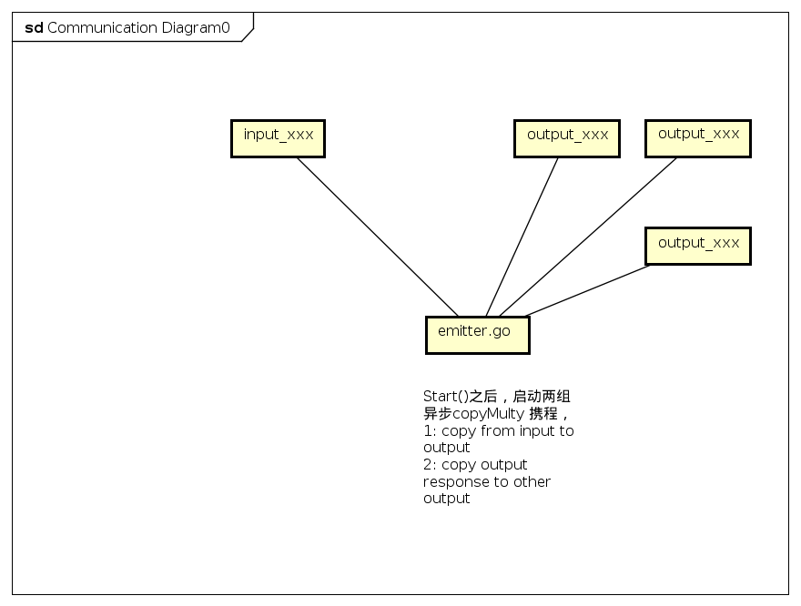

# goreplay 源代码分析
 goreplay 是一个不错流量重放测试工具，支持流量的抓包、记录、冲放等功能，在通读代码之后，觉得虽然代码水平不如大厂的优美，但是不失是一个小巧而好用的个人工具，因此记录笔记如下：
 
 ## 目录结构与初步分析
 目录比较扁平，主要看plugin.go \settings.go \emmit.go 几个主要文件，其他input_xxx ,output_xxx 都是适配具体协议的输入输出插件。
 
 > settings.go 实现对于启动命令参数的解析，决定其注册那些插件到 Plugin.Inputs Plugin.Outputs  两个列表里

 >plugin.go 主要是所有输入输出插件的管理

 > emitter.go 程序核心事件处理实现对于Plugin.Inputs 输入流的读取、是否需要进行middlewear的处理、http美化与修改，之后异步copy流量到所有 Plugin.outputs，同时将所有Plugin.outputs 中有response的数据，复制到所有outputs中 *（这一点没读明白。。还在费解中)*

 > input_xxx.go output_xxx.go  主要是输入输出的插件，实现tcp/http/raw/kafuka 等协议，
实现io.Reader  io.Writer 接口，最后根据配置注册到 Plugin.inputs Plugin.outputs 队列里

 ## 主要核心流程
 主要核心流程如[下图](./goreplay.png),
 </img>

 ## 分析
 整体工具小巧而实用，既可以实现rawsocket的抓包，也可以实现http的记录、冲放，也支持多实例之间的级联。但是有点缺点：

 1. 输出到文件不够“结构化“，以emoji字符作为分割符
 2. 配置信息全靠启动命令参数，比较冗长
 3. input_tcp 与out_tcp 仅仅作为级联使用，无法通过配置实现tcp流量的mirror ，当然这也不是作者原意，通过简单的修改也可以达到目的。 

 如果做更好的replay\proxy 工具，可以参考[frp](https://github.com/fatedier/frp)
 [tcpcopy](https://github.com/session-replay-tools/tcpcopy)
 